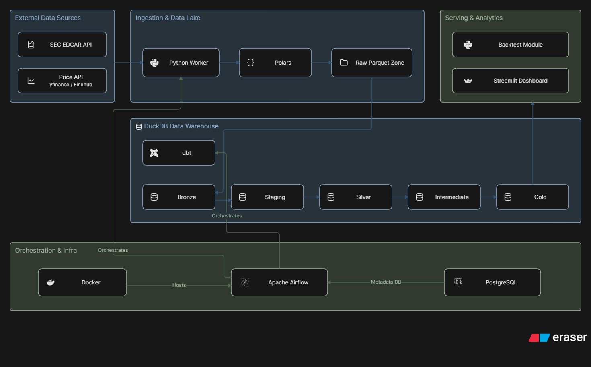

# NASDAQ-100 Quantamental Pipeline

Dự án Data Engineering & Quant Finance End-to-End xây dựng hệ thống thu thập, xử lý và phân tích backtest dữ liệu chứng khoán (Quantamental) cho rổ chỉ số NASDAQ-100.

## Mục tiêu dự án
*   Xây dựng một Data Pipeline chuẩn mực (ELT) phục vụ chiến lược giao dịch định lượng dựa trên yếu tố cơ bản (Fundamentals) và giá (Price).
*   Chống lại các sai lệch kinh điển trong Backtest: **Look-ahead bias** (sử dụng Point-in-Time qua `filing_date`) và **Survivorship bias** (lưu trữ lịch sử SCD2 của danh sách NASDAQ-100).
*   Tối ưu hóa tài nguyên phần cứng cá nhân thông qua kiến trúc Zero-Ops: DuckDB, dbt, Polars, và Airflow LocalExecutor.

## Tech Stack
| Layer | Công cụ | Trách nhiệm chính |
| --- | --- | --- |
| **Ingestion** | `Python`, `Polars`, `Pydantic` | Tải dữ liệu từ API (SEC EDGAR, Finnhub/yfinance), validate schema, ghi ra `Parquet`. |
| **Storage / Warehouse** | `DuckDB`, `Parquet` | Lưu trữ dạng Columnar (OLAP) tốc độ cao, không cần quản lý server. |
| **Transformation** | `dbt-duckdb` | Medallion Architecture (Bronze $\rightarrow$ Silver $\rightarrow$ Gold), xử lý SCD2, Z-Score, Factors. |
| **Orchestration** | `Apache Airflow` | Điều phối batch jobs, quản lý dependency (Tách biệt 2 phase để tránh DuckDB lock). |
| **Analytics / Backtest** | `Python`, `scipy` | Chia Quintile, tính toán IC (Information Coefficient), Turnover, So sánh Benchmark QQQ. |
| **Serving** | `Streamlit` | Trực quan hóa dữ liệu và kết quả Backtest qua Dashboard. |

## Kiến trúc & Luồng dữ liệu (Data Flow)



Dự án tuân thủ nghiêm ngặt **Kiến trúc Medallion** với luồng xử lý ELT một chiều:

1. **Phase 1 (Fetch):** Lấy dữ liệu API song song $\rightarrow$ Lưu `data/raw/*.parquet`.
2. **Phase 2 (Transform - Độc quyền ghi DuckDB):**
    *   **Bronze:** Raw tables từ Parquet.
    *   **Staging:** Đổi tên, làm sạch kiểu dữ liệu.
    *   **Silver:** Xử lý SCD2 (Universe Membership) và Point-in-Time Join.
    *   **Intermediate:** Tính Ratios, Winsorize, Sector-neutral Z-score.
    *   **Gold:** Gộp thành các Factor Pillars (Growth, Value, Quality, Momentum) $\rightarrow$ Equal-weight Composite Score.
    *   **OBT (One Big Table):** Cung cấp data phẳng cho Streamlit và module Backtest.

*(Xem chi tiết tại [architecture.md](architecture.md) và [data-flow.md](data-flow.md))*

## Hướng dẫn cài đặt (Local)

Dự án sử dụng Docker Compose để đóng gói Airflow và Postgres (cho metadata), phần xử lý tính toán chính (DuckDB/dbt) chạy trực tiếp thông qua Python.

**1. Clone dự án và cài đặt môi trường:**
```bash
git clone https://github.com/your-username/NASDAQ-100_Quantamental.git
cd NASDAQ-100_Quantamental
pip install -r requirements.txt
```

**2. Khởi chạy hệ thống Airflow qua Docker:**
```bash
# Đảm bảo Docker Desktop đang chạy (Khuyến nghị bật WSL2 trên Windows)
docker compose up -d

# Truy cập Airflow UI tại: http://localhost:8080 (admin/admin)
```

## Giới hạn đã biết (Known Limitations)
1. **Dữ liệu giá miễn phí (Survivorship Bias nhẹ):** API giá free-tier (yfinance) thường không giữ lại lịch sử giá của các mã đã hủy niêm yết (delisted). Dự án bù đắp bằng cách áp dụng *penalty assumption* trong module Backtest.
2. **DuckDB Single-Writer Constraint:** DuckDB chỉ cho phép 1 process ghi tại 1 thời điểm. Dự án giải quyết triệt để thông qua thiết kế "Tách 2 phase" tại Airflow DAGs (chạy `dbt build` trong 1 BashOperator duy nhất).

## Giấy phép Dữ liệu & Disclaimer
*   Dữ liệu BCTC từ **SEC EDGAR** là public domain của chính phủ Mỹ.
*   Dữ liệu giá (Price) lấy từ các nguồn API miễn phí chỉ phục vụ mục đích **học thuật & nghiên cứu cá nhân**. Mã nguồn không bao gồm và không tái phân phối (redistribute) dữ liệu thô để tuân thủ Điều khoản sử dụng (ToS).
*   Các điểm số tự tính toán (Factor Scores, IC, Z-Score) được hiển thị trên Dashboard là *Derived Work*.
