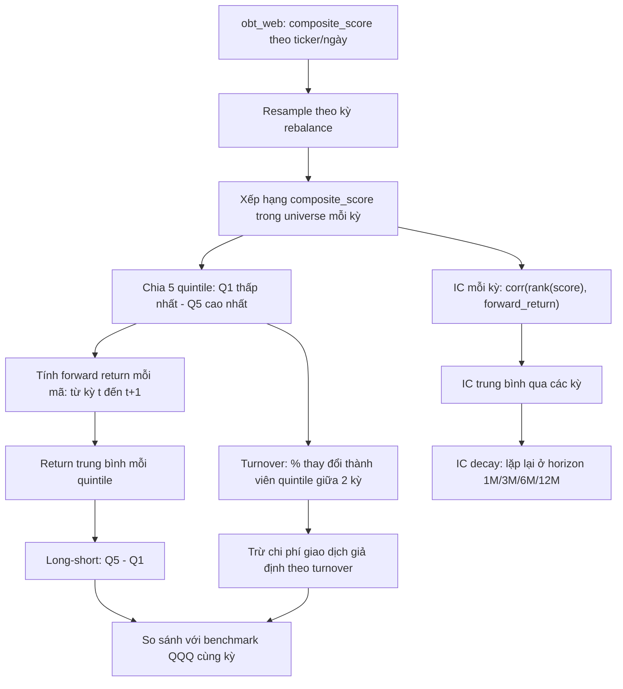
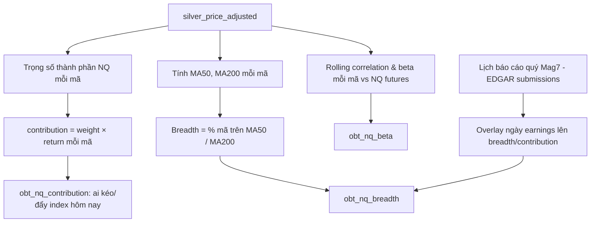

# Luồng Backtest & Phân tích (Analytics Flow)

## 1. Tổng quan luồng backtest

## 2. Chi tiết từng bước

| Bước | Input | Output | Logic |
|---|---|---|---|
| Resample theo kỳ | `obt_web` hàng ngày | composite_score theo kỳ (tháng) | lấy giá trị cuối kỳ |
| Xếp hạng & quintile | composite_score theo kỳ | rank 1–5 | rank theo percentile trong universe tại kỳ đó |
| Forward return | `silver_price_adjusted` | return mỗi mã từ t → t+1 | (P_t+1 − P_t) / P_t |
| Quintile return | forward return + quintile | return trung bình Q1..Q5 | mean theo nhóm |
| Long-short | Q5 return − Q1 return | return long-short | — |
| IC | composite_score, forward return | hệ số tương quan mỗi kỳ | Spearman correlation(rank(score), forward_return) |
| IC decay | IC ở nhiều horizon | IC theo 1M/3M/6M/12M | lặp tính IC với forward return dài hơn |
| Turnover | quintile membership 2 kỳ liên tiếp | % thay đổi | khác biệt tập hợp / kích thước tập hợp |
| Cost-adjusted return | turnover + giả định phí (bps) | return sau phí | return − turnover × cost_bps |
| Benchmark | QQQ return cùng kỳ | so sánh | long-short vs QQQ |

## 3. Luồng phân tích riêng cho NQ

## 4. Output tables & nơi dùng

| Bảng | Nội dung | Dùng ở đâu |
|---|---|---|
| `obt_backtest_quintile` | Return mỗi quintile, long-short, theo kỳ | Tab "Backtest" trên Streamlit |
| `obt_backtest_ic` | IC mỗi kỳ, IC trung bình, IC decay theo horizon | Tab "Backtest" |
| `obt_nq_contribution` | Đóng góp từng mã vào biến động NQ mỗi ngày | Tab "NQ Analysis" |
| `obt_nq_breadth` | % mã trên MA50/MA200 theo ngày | Tab "NQ Analysis" |
| `obt_nq_beta` | Rolling beta/correlation với NQ futures | Tab "NQ Analysis" |

## 5. Quyết định đã chốt & còn mở

**Đã chốt:**
- **Kỳ rebalance: hàng tháng.** Giá có hàng ngày, BCTC có hàng quý — tháng là tần suất đẹp nhất để thấy dịch chuyển factor mà không bị nhiễu do rebalance quá dày.
- **Weighting composite score: equal-weight** — 0.25×Value + 0.25×Growth + 0.25×Momentum + 0.25×Quality. IC-weighted/PCA cần backtest đệ quy (walk-forward), quá phức tạp cho mục tiêu 3 tháng, để dành cho giai đoạn sau nếu còn thời gian.

**Còn mở:**
- **Benchmark:** QQQ cap-weighted hay rổ NASDAQ-100 equal-weight — ảnh hưởng trực tiếp tới kết luận "factor có alpha hay không", cần chốt trước khi viết model so sánh benchmark.
