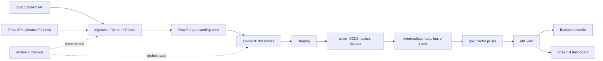

# NASDAQ-100 Quantamental Pipeline — Kiến trúc & Roadmap

## 1. Luồng tổng quan



## 2. Tech stack chi tiết

| Layer | Công cụ | Vai trò |
|---|---|---|
| Fundamentals | SEC EDGAR API (companyfacts, submissions) | Dữ liệu tài chính point-in-time, miễn phí |
| Giá | yfinance hoặc Finnhub (adapter pattern, dễ đổi nguồn) | Giá EOD, cổ tức, chia tách |
| Ingestion | Python + Polars + Pydantic | Parse, validate schema, retry/backoff, rate limit |
| Raw storage | Parquet (`data/raw/...`) | Landing zone bất biến |
| Warehouse | DuckDB (`warehouse.duckdb`) | OLAP columnar, embedded, zero-ops |
| Transform | dbt-duckdb | Medallion, test, snapshot, macro |
| Orchestration | Apache Airflow + Astronomer Cosmos | DAG hóa dbt model, lịch chạy theo cadence |
| Backtest | Python (polars/pandas + scipy/statsmodels) | IC, quintile return, turnover |
| Serving | Streamlit | Đọc trực tiếp từ DuckDB hoặc Parquet export |
| CI | GitHub Actions | `dbt build` + test mỗi pull request |
| Docs | `dbt docs generate`, Mermaid trong README | Lineage graph, sơ đồ kiến trúc |

## 3. Quyết định domain cốt lõi

- Universe NASDAQ-100 point-in-time (dbt snapshot) — không dùng danh sách hiện tại áp cho quá khứ.
- Identifier mapping qua CIK — xử lý đổi ticker, multi-class, spin-off.
- Fundamentals gắn theo **filing date** của EDGAR, không theo kỳ báo cáo.
- Factor set thay cho B/M và QMJ thuần: Momentum (12M-1M), Growth (Rule of 40), FCF yield, EV/Sales, SBC/Revenue, Earnings surprise.
- Z-score trung hoà theo GICS sector, có winsorize.
- Backtest: quintile portfolio, IC từng factor, turnover, chi phí giao dịch giả định, benchmark QQQ.
- Lớp riêng cho NQ: index contribution, breadth, rolling beta/correlation, lịch báo cáo Mag7.

## 4. Schema theo medallion (dbt models chính)

**Bronze** — 1:1 từ raw Parquet, chỉ typing
`bronze_price_eod`, `bronze_company_facts`, `bronze_submissions`, `bronze_index_membership`

**Staging** — rename, cast, lọc field
`stg_price_eod`, `stg_fundamentals`, `stg_dividends`, `stg_universe`

**Silver** — dedupe, SCD2, điều chỉnh corporate actions
`silver_universe_membership` (snapshot SCD2), `silver_price_adjusted`, `silver_fundamentals_pit`

**Intermediate** — ratio, lag, z-score thô
`int_momentum_ratio`, `int_growth_ratio`, `int_fcf_yield`, `int_sbc_ratio`, `int_earnings_surprise`, macro `zscore_sector_neutral`

**Gold** — trụ cột tổng hợp
`gold_growth_pillar`, `gold_value_pillar`, `gold_momentum_pillar`, `gold_quality_pillar`, `gold_composite_score`

**OBT**
`obt_web` (Streamlit), `obt_nq_contribution`, `obt_nq_breadth`

## 5. Cấu trúc repo

```
nasdaq-quantamental/
├── dags/                  # Airflow DAGs (Cosmos-based)
├── ingestion/
│   ├── adapters/          # edgar.py, price_source.py
│   └── watermark.py
├── dbt/
│   ├── models/{bronze,staging,silver,intermediate,gold,marts}
│   ├── snapshots/
│   ├── macros/
│   └── tests/
├── backtest/
├── app/                   # Streamlit
├── data/raw/              # Parquet landing
├── warehouse.duckdb
└── docker-compose.yml     # Airflow webserver/scheduler
```

## 6. Airflow DAGs (theo cadence)

| DAG | Lịch | Việc chính |
|---|---|---|
| `universe_membership_dag` | Hàng tháng | Cập nhật danh sách NASDAQ-100, ghi snapshot |
| `price_eod_dag` | Hàng ngày sau đóng cửa | Ingest giá, điều chỉnh corporate actions |
| `fundamentals_dag` | Theo mùa BCTC (~quý) | Ingest EDGAR companyfacts, point-in-time |
| `dbt_transform_dag` (Cosmos) | Sau khi ingest xong | Chạy toàn bộ model + test |
| `backtest_dag` | Hàng tuần / on-demand | Tính IC, cập nhật kết quả backtest |

**Lưu ý kỹ thuật:** DuckDB single-writer — các task cùng ghi `warehouse.duckdb` cần đặt `max_active_tasks=1` hoặc nối tuần tự, tránh lỗi lock.

## 7. Roadmap 3 tháng (từ 04/10/2026)

| Tháng | Trọng tâm |
|---|---|
| 1 | Ingestion (EDGAR + price), raw Parquet, universe point-in-time, Airflow cơ bản |
| 2 | dbt medallion đầy đủ, factor set mới, sector-neutral z-score, dbt tests + snapshots |
| 3 | Backtest module, lớp phân tích NQ, Streamlit, dbt docs, README + Mermaid |

## 8. Giới hạn đã biết (nêu rõ trong README)

- Dữ liệu giá free tier có thể thiếu mã đã hủy niêm yết → backtest còn survivorship bias nhẹ.
- DuckDB single-writer → cần tuần tự hoá task ghi.
- Phạm vi v1 chỉ NASDAQ-100; schema để sẵn cột `market`/`exchange` để mở rộng VN sau này.

## 9. Vai trò của Airflow

Airflow chỉ điều phối, không tự xử lý dữ liệu.

| Airflow điều phối | Airflow KHÔNG làm |
|---|---|
| Gọi script ingestion theo lịch, retry khi lỗi | Không parse/transform — việc của Python và dbt |
| Gọi `dbt run`/`dbt test` qua Cosmos, mỗi model = 1 task | Không thực thi SQL — DuckDB tính toán |
| Đảm bảo thứ tự ingestion → bronze → ... → gold | Không phục vụ dashboard — Streamlit chạy app riêng, không nằm trong DAG |
| Gọi job backtest theo lịch/on-demand | Không lưu trữ dữ liệu — vai trò của Parquet/DuckDB |
| Cảnh báo khi task lỗi | Không xử lý real-time — bản chất là scheduler batch |

## 10. Docker & chiến lược public

- **Docker hoá từ Phase 1** để ai clone repo cũng chạy được bằng `docker compose up`: Airflow (webserver + scheduler + Postgres metadata riêng của Airflow, khác DuckDB), volume mount `warehouse.duckdb` và `data/raw/`.
- **Không public toàn bộ Airflow** — cần máy chạy 24/7, tốn chi phí hosting.
- **Chỉ public Streamlit** lên Streamlit Community Cloud (miễn phí), đọc từ snapshot Parquet/CSV được refresh định kỳ qua GitHub Actions (miễn phí, chạy theo lịch). Airflow + DuckDB chỉ chạy local/CI, không cần public.

## 11. ELT hay ETL

Dự án là **ELT**, đúng với dbt + DuckDB:
- **Extract + Load:** ingestion chỉ fetch thô từ EDGAR/price API, validate schema, ghi thẳng vào Parquet/bronze — không tính toán nghiệp vụ.
- **Transform:** toàn bộ logic (ratio, z-score, point-in-time join, factor) nằm trong dbt, chạy sau khi dữ liệu đã vào DuckDB. dbt vốn là công cụ cho ELT.

## 12. Batch hay streaming

**Batch**, theo nhịp ngày/tuần/quý — khớp với bản chất dữ liệu (giá EOD, BCTC theo quý) và lý do đã bỏ Kafka khỏi stack. Nếu sau này muốn tín hiệu real-time cho NQ, đó là hệ thống tách biệt (websocket consumer riêng), ghi vào README như hướng mở rộng tương lai, không thuộc MVP 3 tháng.

## 13. Tổng kết toàn bộ quyết định

| Hạng mục | Quyết định |
|---|---|
| Thị trường | NASDAQ-100 trước, thiết kế market-agnostic để thêm VN sau (adapter) |
| Mục đích | Portfolio data pipeline để xin intern, hoàn thành trong 3 tháng (từ 04/10/2026) |
| Mô hình xử lý | ELT, batch (không streaming) |
| Extract/Load | SEC EDGAR + price API (adapter, free tier) → Parquet raw, qua Python/Polars/Pydantic |
| Warehouse/Transform | DuckDB + dbt-duckdb, medallion 5 tầng, snapshot SCD2, incremental, custom test, macro z-score |
| Orchestration | Airflow + Cosmos, chỉ điều phối lịch và thứ tự, chạy batch |
| Serving | Streamlit, public qua snapshot refresh bằng GitHub Actions — không public Airflow |
| Hạ tầng | Docker hoá từ Phase 1 cho reproducibility |
| Factor framework | Thay B/M và QMJ thuần bằng Growth, FCF yield, EV/Sales, SBC ratio, Earnings surprise, Momentum — phù hợp universe growth-tilted |
| Điểm khác biệt domain | Universe point-in-time, identifier mapping, fundamentals theo filing date, sector-neutral z-score, backtest có IC/turnover/benchmark QQQ, lớp phân tích riêng cho NQ |
| Giới hạn đã biết | Survivorship bias nhẹ ở free-tier price data, DuckDB single-writer cần tuần tự hoá task ghi |

## 14. Chi phí RAM khi chạy Docker

Quickstart mặc định của Airflow (CeleryExecutor + Redis + Flower) yêu cầu tối thiểu 4GB RAM, 2 CPU, ~10GB ổ đĩa — nhưng dư thừa cho một người chạy batch job. **Khuyến nghị dùng `LocalExecutor`**, bỏ Redis/Celery/Flower.

| Thành phần | RAM ước tính |
|---|---|
| Airflow webserver + scheduler (LocalExecutor) | ~1.5–2.5 GB |
| Postgres (chỉ metadata Airflow) | ~200–400 MB |
| Task ingestion (Python/Polars) | ~300–800 MB khi chạy |
| Task dbt-duckdb transform | ~1–2 GB khi chạy |
| Streamlit (local) | ~200–400 MB |
| **Tổng khi chạy đồng thời** | **~6–8 GB — nên có máy 8–16 GB RAM** |

Docker Desktop (Mac/Windows) chiếm thêm RAM cho VM nền, chưa tính trong bảng — nên để dư margin. Khi public, chỉ Streamlit cần chạy 24/7 (trên Streamlit Cloud); Airflow + DuckDB chỉ cần chạy local/CI khi refresh dữ liệu.

## 15. Giấy phép dữ liệu & phạm vi được public

| Nguồn | Public lại được không |
|---|---|
| SEC EDGAR (fundamentals) | Được — dữ liệu chính phủ Mỹ, public domain, không giới hạn redistribution |
| Giá từ yfinance | Không nên — API không chính thức, Yahoo giới hạn chỉ dùng cá nhân; Yahoo không được phép redistribute lại dữ liệu mua từ nhà cung cấp gốc |
| Giá/metric từ Finnhub free tier | Không được — ToS nêu rõ free tier chỉ dùng cá nhân, redistribute cần được Finnhub chấp thuận bằng văn bản |
| Factor score / backtest tự tính (composite score, z-score, IC, quintile return) | Được — là sản phẩm phân tích gốc (derived work), không phải dữ liệu thô |

**Nguyên tắc khi làm dashboard public:** chỉ hiển thị derived metrics (factor score, xếp hạng, kết quả backtest); không hiển thị bảng giá OHLCV thô hay cho tải CSV giá gốc từ yfinance/Finnhub free tier. Ghi rõ disclaimer nguồn dữ liệu và mục đích học thuật/demo trên dashboard. Đây không phải tư vấn pháp lý — nên tự đọc lại ToS hiện hành của từng nhà cung cấp trước khi public chính thức.

## 16. Rủi ro triển khai cần xử lý trước (tránh lỗi/crash)

**A. DuckDB single-writer + Airflow chạy song song**
- Nguy cơ: hai task cùng mở ghi `warehouse.duckdb` → lock error, task crash.
- `max_active_tasks=1` chỉ là workaround cấp DAG, không đảm bảo an toàn nếu DAG khác cũng đụng file này cùng lúc.
- Xử lý chắc hơn: nối các task ghi DuckDB bằng dependency tường minh (`>>`) thay vì chỉ dựa pool/slot config; đóng connection trong `try/finally` để không để sót lock file khi task bị kill giữa chừng; nếu một lần chạy từng crash để lại lock, cần dọn lock trước khi retry.

**B. RAM trên Windows khi chạy dbt build + Airflow cùng lúc**
- 8GB RAM trên Windows thực tế rất sát, dễ khiến Docker Desktop treo hoặc container bị OOM-kill.
- Test ngay tuần đầu Phase 1: `docker compose up` với LocalExecutor, trigger `dbt_transform_dag`, theo dõi bằng `docker stats`.
- Nếu máy yếu: cân nhắc chạy dbt/DuckDB **ngoài Docker** (venv Python local), chỉ Docker hoá phần Airflow để giảm tải RAM.

**C. Airflow dễ ngốn thời gian debug infra thay vì domain logic**
- Rủi ro chính là tiến độ, không phải kỹ thuật thuần: lịch 3 tháng không có buffer cho Airflow lỗi vặt (scheduler không nhận DAG, webserver không start, metadata DB migration lỗi).
- Mốc chặn: hết tuần 1 Phase 1 mà `docker compose up` + 1 DAG đơn giản chưa chạy ổn định, chuyển sang phương án nhẹ hơn (cron + Makefile, hoặc Prefect) — không để Airflow thành nút thắt cả project.

**D. Factor construction chưa có bước validate — có thể ra kết quả sai âm thầm**
- **Đã chốt: equal-weight** cho `gold_composite_score` ở MVP Phase 1 — 0.25×Value + 0.25×Growth + 0.25×Momentum + 0.25×Quality. IC-weighted/PCA cần backtest đệ quy (walk-forward IC) và tự mang rủi ro look-ahead nếu dùng IC tính trên toàn mẫu — để dành cho giai đoạn sau nếu còn thời gian.
- Thiếu bước kiểm tra tương quan chéo giữa factor (orthogonalization/VIF): factor tương quan cao mà cộng trực tiếp sẽ làm composite score thiên lệch, không báo lỗi gì, chỉ cho kết quả sai — vẫn cần làm dù đã chốt equal-weight.

**E. Lỗi gọi API bên ngoài — nguyên nhân crash phổ biến nhất của task ingestion**
- EDGAR yêu cầu header `User-Agent` hợp lệ kèm contact info — thiếu sẽ bị từ chối (403).
- Rate limit (EDGAR 10 req/s, Finnhub free tier 60 req/phút) — cần retry có backoff, không retry ngay lập tức.
- Free-tier price data thiếu mã delisted — document rõ trong backtest output là giới hạn đã biết, kèm kịch bản "pessimistic" giả định penalty khi delist.
