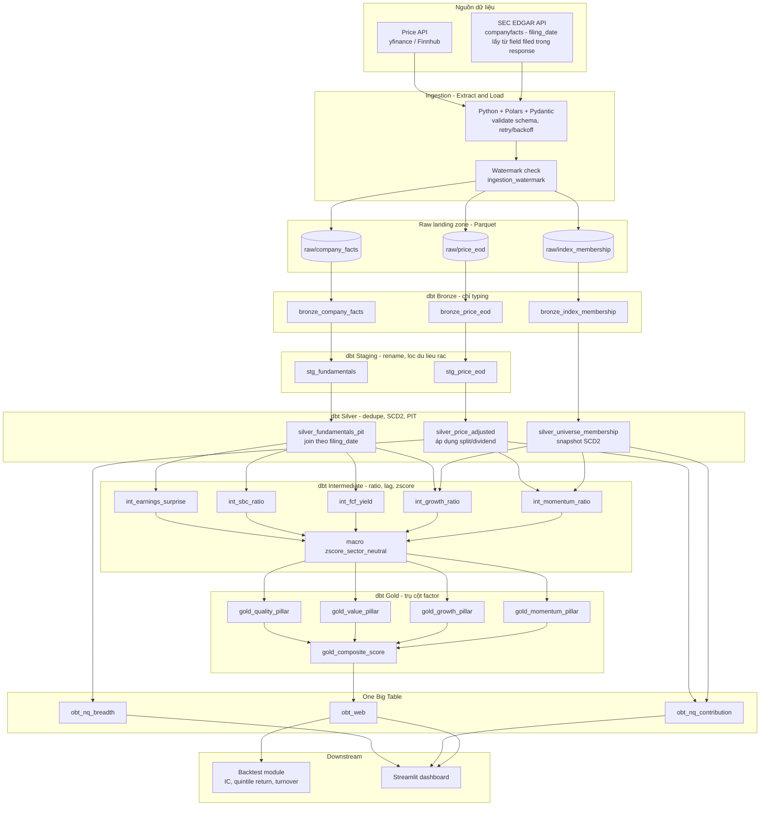
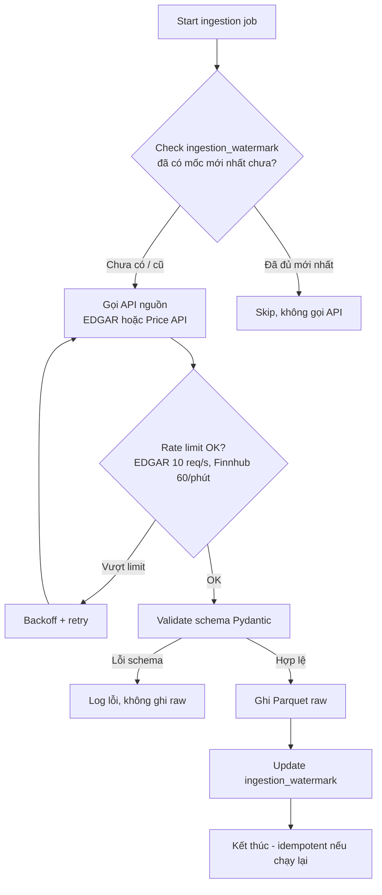
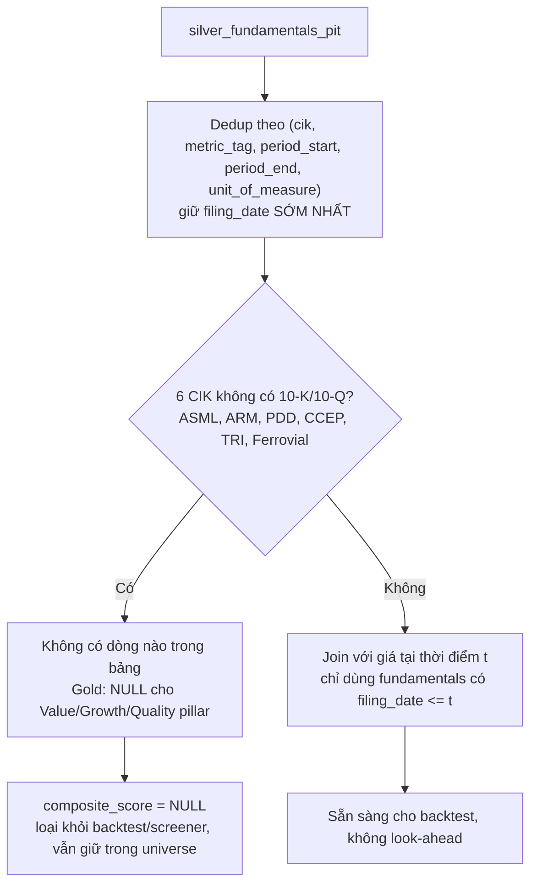
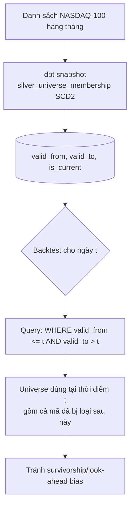
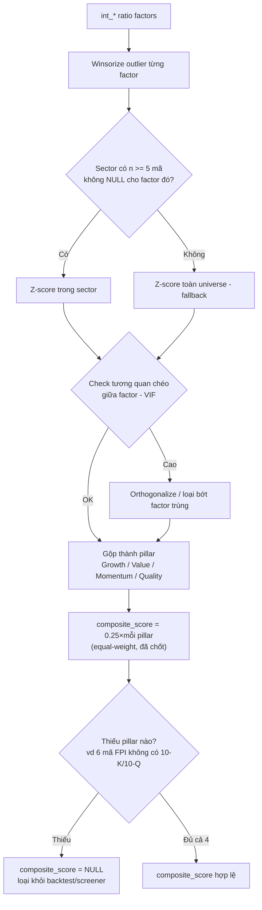
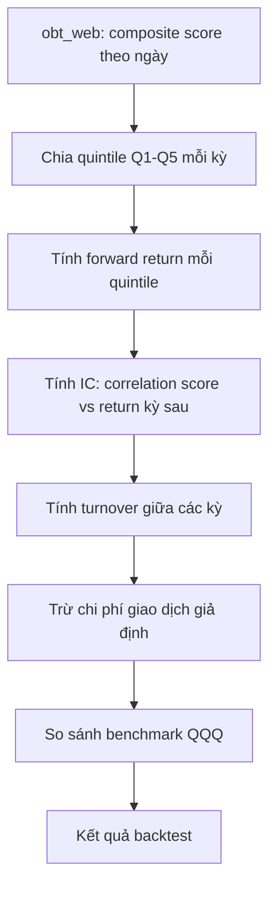
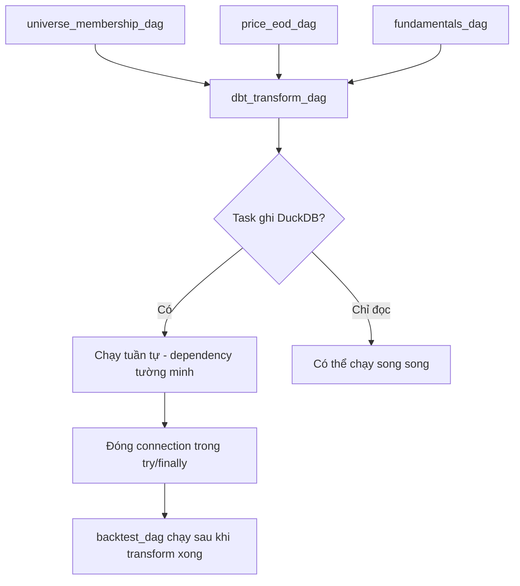

# Luồng dữ liệu (Data Flow) — Từ thô đến tinh

## 1. Luồng chi tiết từng bước

## 2. Giải thích từng giai đoạn

| Giai đoạn | Input | Output | Việc chính |
| --- | --- | --- | --- |
| Ingestion (E+L) | EDGAR, price API | Parquet raw | Fetch thô, validate schema (Pydantic), kiểm watermark để không ingest trùng |
| Bronze | Parquet raw | `bronze_*` | Load vào DuckDB, chỉ ép kiểu dữ liệu, không sửa logic |
| Staging | `bronze_*` | `stg_*` | Đổi tên cột, lọc field cần dùng, chuẩn hoá định dạng |
| Silver | `stg_*` | `silver_*` | Dedupe, SCD2 cho universe membership, điều chỉnh giá theo corporate actions, join fundamentals theo **filing date** (point-in-time) |
| Intermediate | `silver_*` | `int_*` | Tính ratio từng factor (momentum, growth, FCF yield, SBC ratio, earnings surprise), rồi chuẩn hoá z-score trung hoà theo sector |
| Gold | `int_*` (đã z-score) | `gold_*` | Gộp thành trụ cột (pillar) và điểm tổng hợp `gold_composite_score` |
| OBT | `gold_*`, `silver_*` | `obt_*` | Một bảng phẳng cho dashboard, cộng thêm bảng riêng cho phân tích NQ (contribution, breadth) |
| Downstream | `obt_*` | Kết quả backtest, dashboard | Backtest tính IC/turnover/quintile return; Streamlit đọc trực tiếp để hiển thị |

## 3. Airflow điều phối theo giai đoạn nào

| DAG | Giai đoạn phụ trách |
| --- | --- |
| `universe_membership_dag` | Ingestion → Bronze → Silver cho `silver_universe_membership` |
| `price_eod_dag` | Ingestion → Bronze → Silver cho `silver_price_adjusted` |
| `fundamentals_dag` | Ingestion → Bronze → Silver cho `silver_fundamentals_pit` |
| `dbt_transform_dag` (Cosmos) | Staging → Intermediate → Gold → OBT, chạy sau khi 3 DAG trên hoàn tất |
| `backtest_dag` | OBT → kết quả backtest |

Thứ tự thô → tinh luôn đi một chiều: **Raw Parquet → Bronze → Staging → Silver → Intermediate → Gold → OBT**. Không có bước nào ghi ngược lại tầng trước, giúp dễ debug: lỗi ở đâu chỉ cần chạy lại từ đúng tầng đó.

## 4. Data flow phân rã theo từng phần phức tạp

### 4.1 Ingestion & Idempotency

*Chạy lại job này nhiều lần trong ngày không tạo dữ liệu trùng, nhờ watermark chặn ngay từ đầu.*

### 4.2 Point-in-time fundamentals join

### 4.3 Universe membership (SCD2) & truy vấn point-in-time

### 4.4 Factor → Composite score

### 4.5 Backtest

### 4.6 Airflow DAG dependency & DuckDB concurrency

