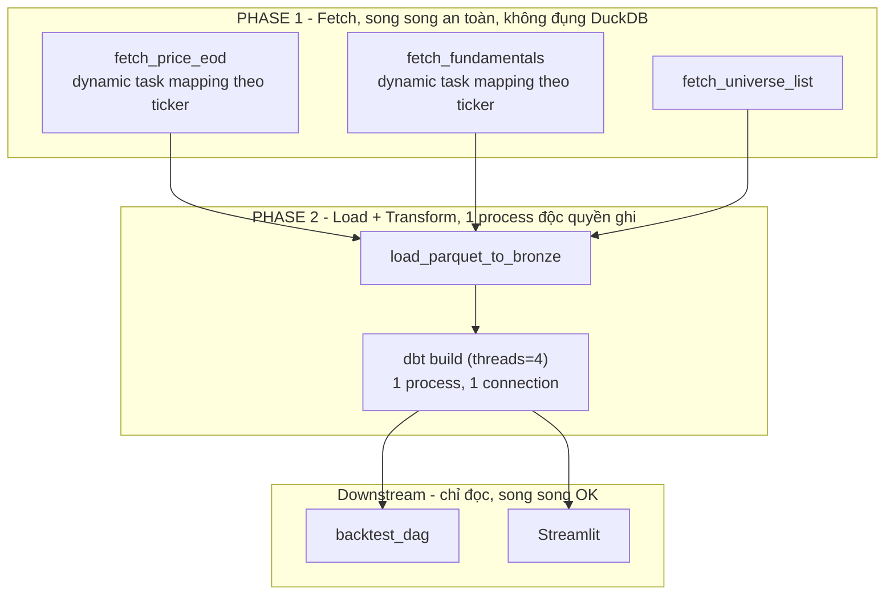
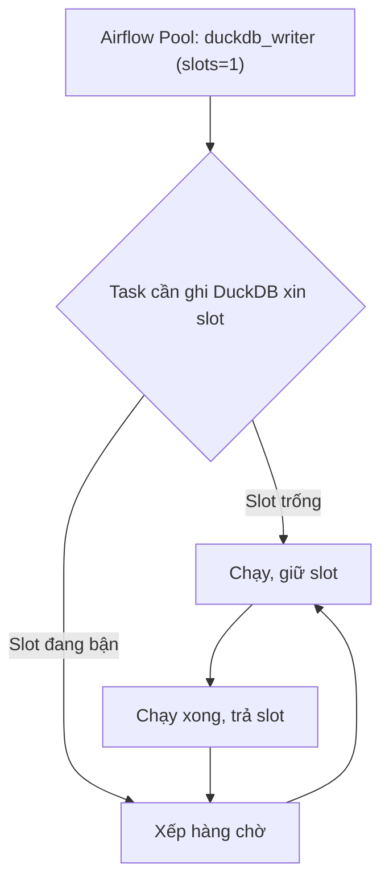

# Luồng thực thi (Execution Flow) — Sự điều phối của Airflow

## 1. Vì sao cần tách 2 phase — nguyên lý concurrency của DuckDB

Theo tài liệu chính thức của DuckDB:
- DuckDB cho phép **chính xác một process** giữ kết nối read-write vào file database tại một thời điểm.
- Trong process đó, nhiều thread/connection được ghi đồng thời an toàn nhờ MVCC + optimistic concurrency — đây là lý do `dbt build` với `threads: 4` vẫn an toàn, **miễn là chạy trong một process duy nhất**.
- Nhiều process cùng mở ghi (read-write) vào cùng file → lỗi file lock, task crash. Đây đúng là rủi ro đã nêu ở mục 16 file kiến trúc.
- Nhiều process chỉ được đọc đồng thời (`read_only=True`) khi **không có process nào đang ghi**.

**Nguyên tắc "Tách biệt 2 phase" rút ra từ đó:**

| Phase | Việc làm | Có đụng DuckDB không |
|---|---|---|
| **Phase 1 — Fetch** | Gọi API bên ngoài (EDGAR, price source), ghi ra Parquet riêng theo ticker/loại dữ liệu | Không — an toàn chạy song song bao nhiêu task cũng được |
| **Phase 2 — Load + Transform** | Đọc toàn bộ Parquet từ Phase 1, load vào bronze, chạy `dbt build` | Có — chỉ **một process duy nhất** được giữ quyền ghi trong suốt phase này |

## 2. Sơ đồ điều phối Airflow theo 2 phase

## 3. Điểm dễ bị bỏ sót khi dùng Cosmos

Cosmos mặc định biến **mỗi dbt model thành một Airflow task riêng** (mỗi task là một process con). Pattern này an toàn với warehouse client-server (Snowflake, BigQuery, Trino — nơi nhiều connection đồng thời là chuyện bình thường), nhưng với DuckDB file-based, nếu Airflow chạy song song các model độc lập (không có dependency logic giữa chúng), sẽ có 2+ process cùng mở ghi → lỗi lock.

| Cách triển khai | Mô tả | An toàn với DuckDB? |
|---|---|---|
| Cosmos mặc định (task-per-model) | Mỗi model = 1 task riêng, Airflow có thể chạy song song model độc lập | Rủi ro — cần ép serialize thêm |
| Cosmos + Airflow Pool (`duckdb_writer`, slots=1) | Giữ task-per-model, nhưng mọi task ghi DuckDB xin chung 1 slot | An toàn — Airflow tự đảm bảo chỉ 1 task chạy tại 1 thời điểm |
| Gộp thành 1 task duy nhất gọi `dbt build` | Bỏ Cosmos per-model, dùng BashOperator/PythonOperator gọi `dbt build` một lần | An toàn nhất, đơn giản nhất |

**Quyết định: dùng cách thứ 3** — BashOperator chạy một lệnh `dbt build` duy nhất, không dùng Cosmos tách từng model thành task riêng. Cách này triệt tiêu hoàn toàn rủi ro DuckDB concurrency lock vì chỉ một process tồn tại trong suốt Phase 2. Không mất gì khi chọn vậy: nếu sau này đổi sang warehouse client-server, có thể chuyển lại sang Cosmos task-per-model mà không phải đổi domain logic.

## 4. Cơ chế Airflow Pool (nếu vẫn muốn giữ Cosmos task-per-model)

Pool là cơ chế gốc của Airflow để giới hạn số task chạy đồng thời theo một tài nguyên dùng chung. Gán `pool="duckdb_writer"` với `slots=1` cho mọi task chạm vào `warehouse.duckdb` — không cần tạo dependency giả tạo giữa các model vốn không liên quan nhau về mặt logic.

## 5. Checklist khi implement

- [ ] Phase 1 (fetch) không có task nào import `duckdb` hay mở connection tới file database.
- [ ] Phase 2 chỉ có 1 task (hoặc các task được serialize chắc chắn qua Pool slots=1) chạm vào `warehouse.duckdb`.
- [ ] Mọi connection DuckDB mở trong `try/finally`, đảm bảo đóng kể cả khi task lỗi giữa chừng.
- [ ] Test sớm với 5–10 ticker trước khi mở rộng ra cả NASDAQ-100, theo dõi log Airflow xem có lỗi lock không.
